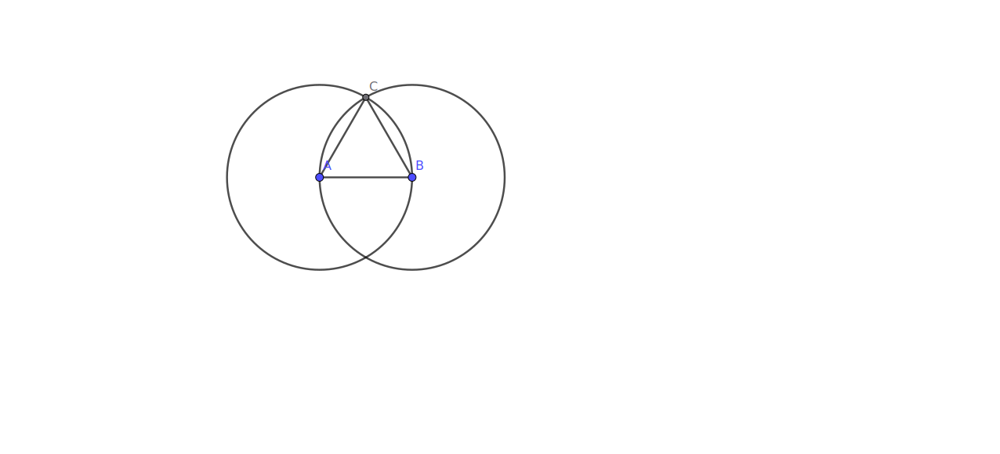

# BOOK 1 PROPOSITION 1

On a given finite straight line to construct an equilateral triangle

## Construction

- We start with a straight line AB
- Using Point A as the center and the line segment AB as the radius we construct a circle
- Using Point B as the center and the line segment BA as the radius we construct another circle
- We label the point of intersection as C
- We connect the points A and C with the line segment AC
- We connect the points B and C with the line segment BC
- The resulting triangle is an equilateral triangle

## Proof

- Since AB and AC are both radii of the circle centered at A, we have AB = AC
- Since BA and BC are both radii of the circle centered at B, we have BA = BC
- Therefore AB = AC = BC
- Since the above are the sides of our triangle, we have constructed the required equilateral triangle
