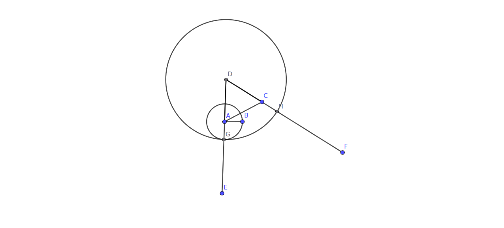

BOOK 1 PROPOSITION 2

To place at a given point (as an extremity) a straight line equal to a given straight line.

## Construction

- We start with the line AB and the external point C
- We construct the line segment AC along with the equilateral triangle ADC
- On point A, using AB as the radius, we construct a circle
- We extend the line segments DA and DC to DE and DF
- G is the intersection point of our circle on DE
- Using D as the center and DG as the radius, we construct another circle
- H is the intersection point of our new circle on line segment DF
- CH is now a a straight line placed at an extremity that is also equal to our given line AB

## Proof

- Line DH = DC + CH ; Line DG = DA + AG
- Since they are both the radii of the same circle
- DC + CH = DA + AG
- DC is also equal to DA since they are both sides of a equilateral triangle
- So CH = AG
- AG is also the radius of our cicle a along with AB
- Hence we get CH = AB
- We have placed the line that is equal to our given line
