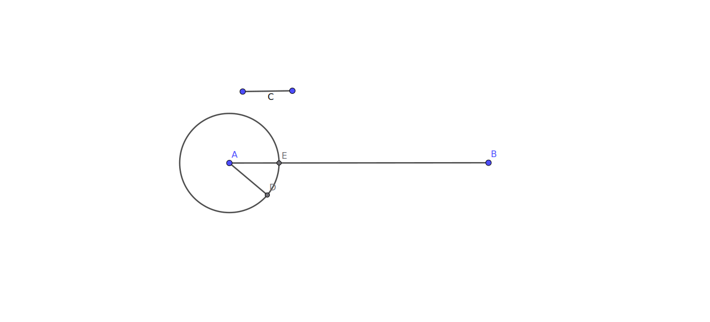

# BOOK 1 PROPOSITION 3

Given two unequal straight lines, to cut off from the greater a straight line equal to the less.

## Construction

- We have the lines AB and C where C is shorter than AB
- Using Proposition 2, we construct the line segment AD which is equal to C
- We draw a circle with A as the center and AD as the radius
- We mark the point E where the circle intersects with our longer line AB
- AE is our cut off line segment equal to the shorter line C

## Proof

- We know that our line segment AD is equal to the line C from proposition 2
- After constructing the circle, we have the two radii AE and AD
- Since radii of the same circle are equal, we have AE = AD
- But AD is equal to the segment C as well
- Thus we have the radius AE = C which is our cutoff from the longer line AB
