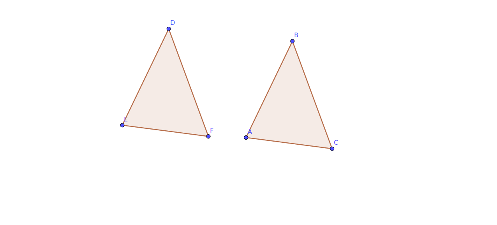

# BOOK 1 PROPOSITION 4

If two triangles have the two sides equal to two sides respectively, and have the angles
contained by the equal straight lines equal, they will also have the base equal to the base,
the triangle will be equal to the triangle, and the remaining angles

## Construction

- We are given the triangles that have two equal sides and the equal angle between them

## Proof

- Using the Common Notion 4 which states that :
  "Things which coincide with one another are equal to one another."
- By placing the equal sides on top of each other AC and EF along with ED and AB
- We also have an equal angles between them DEF and BAC
- We see that the side DF coincides with BC,
  the other interior angles are equal and the triangles are equal
