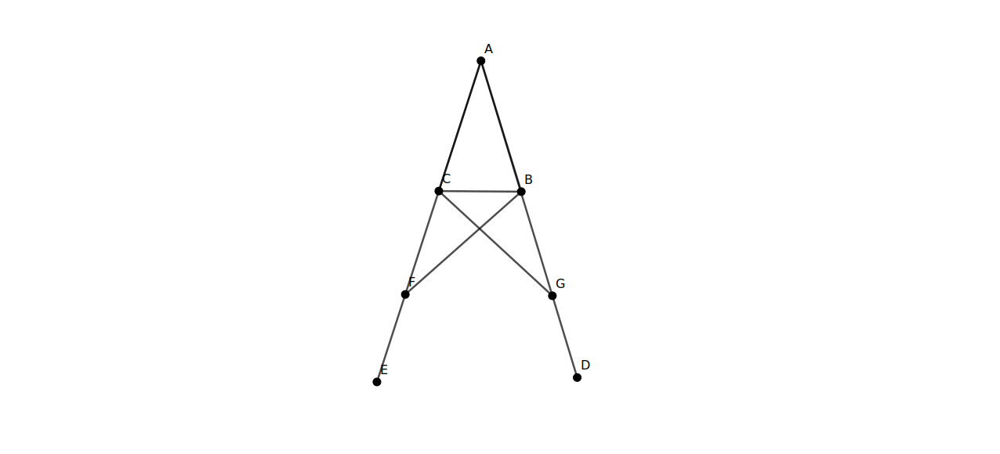

# BOOK 1 PROPOSITION 5

In isosceles triangles the angles at the base are equal to one another, and, if the equal straight lines
be produced further, the angles under the base will be equal to one another.

## Construction

- We have the isoceles triangle where sides AB and AC are equal
- We extend side AB to AD and side AC to AE
- On the side AE, we pick at random a point F
- Using Proposition 3, we construct the line segment BG which is equal CF
- We need to prove that angle ACB and ABC are equal as well angle CBG and BCF are equal

## Proof

- Taking triangles ABF and ACG
  - We have the common angle A
  - Since it is an isoceles triangle, AC = AB
    - From Prop 4, we have also constructed lines BG = CF
    - Hence we AF = AG
  - Thus using Proposition 4, we have triangles ABF and ACG are equal, giving us
    angles AFB and AGC as equal, angles ABF and AGC as equal along with sides GC equal to BF
- Using the above equal triangles, we conside triangles BCF and CBG
  - CF and BG are qual from our construction using Prop 4
  - Angles AFB and AGC are equal from above
  - GC and BF are sides also equal from above
  - Again using Proposition 4, we have triangles BCF and CBG are equal with equal sides
    and corresponding angles
- Since the whole angle ABF and AGC are equal, along with the angles BCG and CBF
  - The interior angles ACB and ABC are also equal (subtracting the whole from the parts)
- Since triangles BCF and BCG are equal, the exterior angles BCF and CBG are equal
