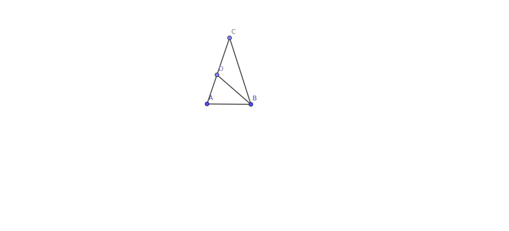

# BOOK 1 PROPOSITION 6

If in a triangle two angles be equal to one another, the sides which subtend the equal angles will also
be equal to one another.

## Construction

## Proof

- We are given the triangle ABC where angle ABC is equal to angle CAB
- We consider that side AC is larger than side BC
- We know how to cut off a side from the larger that is equal to the less from Prop 4
- Hence we have AD is equal to BC
- Angle DAB is common along with the common length AB
- From Prop 5, we have if the sides are equal and the angle between them is equal then the triangles
  are equal
- Which is absurd since triangles BAD is not equal to triangle ABC
- We likewise see the same result if we consider BC larger AC
- Hence this is a proof by contradiction that shows that neiher side is larger and
  the two sides are equal
